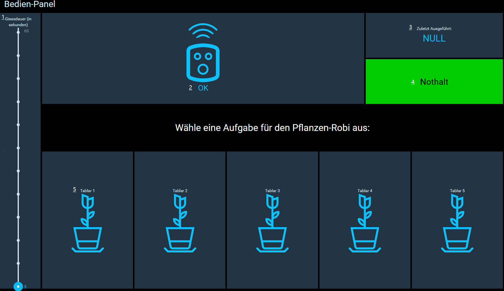

# Bedienung
Diese Bedienungsanleitung zeigt eine Übersicht der Bedienvorgänge die auf dem GUI: [Pflanzenroboter Weboberfläche](http:harveg:8080) bereitgestellt werden. Für die Bedienung ist entweder ein Tablet oder ein Bildschirm mit mindestens 1024 Pixel Breite nötig.
>[!INFO]
>
> Der Harveg Pflanzenroboter sollte nur von instruierten Personen lokal bedient und konfiguriert werden, für Drittpersonen steht eine entsprechend abgesicherten Webzugang zur Verfügung: https://www.myopenhab.org

## Main GUI (Übersicht)

In der Übersicht wird der aktuelle Zustand des Roboters angezeigt und es können die wichtigsten Konfigurationen vorgenommen werden. Die Ansicht der Übersicht variert je nach Berechtigung des Bedieners. Für das TecLab steht ein Login mit den folgenden Nutzerangaben zur Verfügung, welches genutzt werden kann um Änderungen and der Konfiguration vorzunehmen:

>[!ADMIN]
>
>teclab pflanzenrobi24

1. Zeigt die Zustände der Services und Versorgungs-Anschlüsse der Anlage an. Beim Klick auf die Sammelanzeige "Alle Services" werden die beiden Kategorien **Dienste** und **Versorgung** angezeigt. Die Gruppe Dienste übersteuert alle anderen Services, daher sobald ein Dienst auf den Zustand OFF wechslet ist die Sammelanzeige auch Rot und OFF.
2. Das Feld zeigt den Zustand des Wassermelder an: **Grün=kein Alarm** / **Rot=Wasser-Austritt**
1. Hier wird das Kamera-Livebild angezeigt, Mit klick auf das Feld wird die Historie angeigt wo alle Aufnahmen für die **Time-Laps** Filme absteigend anzeigt werden. 
1. Anzeige der aktuellen Klima-Werte im Raum
1. Sammelanzeige der System-Benachrichtigungen und Alarme, falls vorhanden
1. Zeitpunkt der Pflanzenbeleuchtung Abschaltung (Konfiguration der Beleuchtung durch Klicken auf die Schaltfläche). Es können Systembedingt nur die Zeitpunkte 17:00,18:00,19:00 ausgewählt werden (durch klicken)

>[!MORELIKETHIS]
>
>**Time-Laps** ist eine Filmmethode zur beschleunigten Darstellung von Bildabläufen.
Der 'Zeitraffer' ist eine filmische Methode zur Beschleunigung der Langzeitaufzeichnung von Bewegungsabläufen, bei der die Bildfrequenz (Bildrate) der Aufnahme im Verhältnis zur Abspielfrequenz herabgesetzt wird. Werden die Aufnahmen dann mit normaler Geschwindigkeit abgespielt, scheint der aufgenommene Vorgang schneller abzulaufen. Dadurch werden auch Änderungen sichtbar, die in Echtzeit aufgrund ihrer langsamen Natur vom Menschen nicht oder nur schwer wahrnehmbar sind.

### Dashboard für Konfiguration

Hier können die angemeldeten Benutzer die wichtigsten Konfigurationen für den Betrieb des Pflanzenroboter einsehen. Weiter können zusätzliche Einstellungen über die beiden Tabs **Standorte & Eigenschaften** am unteren Bildrand vorgenommen werden.
* Standorte: Einstellungen der Kameras, Licht & Ressourcen (Daten zu Wasser und Stromverbrauch)
* Eigenschaften: Einstellungen zu Energie, Wasser und Geräteeingenschaften

1. Schalter zur Aktivierung des Benachrichtigungsdienst (auf die OpenHAB App)
1. Hinterlegung der E-Mailadresse des Benutzers der OpenHAB APP
1. Sammelanziege der System-Benachrichtigungen und Alarme, falls vorhanden
1. Grenzwerte für die Alarmierung der Klima-Überwachung
1. Schaltfläche zum Zurücksetzten des Kamera-Bild Zählers (Start eines neuen Angebots-Durchlaufes)

## Sidebar (Seitenleiste) 
Die Seitenleiste zeigt die weiteren Unterseiten an welche zur Verfügung stehen, aktuell sind dies:

|Unterseiten | Beschreibung | Link |
|---------|----------|---------|
| Bedien-Panel alle Tablare | Bedien-Panel für den Pflanzenroboter mit den verfügbaren Sequenzen pro Tablar | /page/page_HabPanel |
| Kamera Dashboard | Kamera Livestream und Historie der Aufnahmen | /page/camera_dashboard |
| Ressourcen Tablar 11 | Graph zu Energie- & Wasserverbrauch des entsprechenden Tablars | /page/ressource11 |
| Ressourcen Tablar 12 | Graph zu Energie- & Wasserverbrauch des entsprechenden Tablars | /page/ressource12 |
| Ressourcen Tablar 13 | Graph zu Energie- & Wasserverbrauch des entsprechenden Tablars | /page/ressource13 |
| Ressourcen Tablar 14 | Graph zu Energie- & Wasserverbrauch des entsprechenden Tablars | /page/ressource14 |
| Ressourcen Tablar 15 | Graph zu Energie- & Wasserverbrauch des entsprechenden Tablars | /page/ressource15 |

## Bedien-Panel

Dieses Panel dient zur Steuerung des Pflanzenroboters durch Auswahl der gewünschten Sequenz (vordefinierte automations-Abläufe des [farmbots](https://wwww.my.farmbot.io))

1. Regler zur Einstellung der gewünschten Giessdauer in Sekunden (Dieser wWert wird bei den meisten Sequenven als Variabel für die Giessdauer berücksichtigt)
1. Aktueller Zustand des Gartenroboters (OK, busy..., Verbindungsunterbruch)
1. Schaltfläche und Anzeige zuletzt ausgeführte Sequenz als Namen sofern bekannt oder als Sequenz-ID. Diese Schaltfläche stellt auch weitere Sequenzen wie: find home, Tests oder die Aufnahmefuktion des Farmbots, in einem Kontextmenue zur Verfügung (klichen auf Fläche)
1. Schaltfläche und Anzeige des Nothalt-Zustandes: **Grün=Entsprerrt** / **Rot=Anlage im Nothalt** (durch klicken wir die Anlage entsperrt oder ein Nothalt ausgelöst)
1. Kontextmenue der Sequenzen für jedes der fünf Tablare

### Weitere Sequenzen

### Kontextmenue Tablar Sequenzen
Die Sequenzen sind jewels so programmiert, dass der Roboter entweder nur die linke oder rechte Seite giesst oder falls eine Sequenz auf das ganze Tablar ausgewählt werden kann, alle Pflanzen die im [farmbot farm-designer](https://software.farm.bot/v2/Web-App/farm-designer) hinterlgt sind. 
>[!IMPORTANT]
>
>Die Pflanzen müssen im [farmbot Web-App](https://wwww.my.farmbot.io) zuerst auf das entsprechende Tablar hinzugefügt werden, damit sie bei der entsprechenden Sequenz berücksichtigt werden. Es können somit auch einzelne Pflanzen entfernt oder verschoben werden, wenn dies auch auf dem Farmbot farm-designer entsprechend nachgeführt wird.

